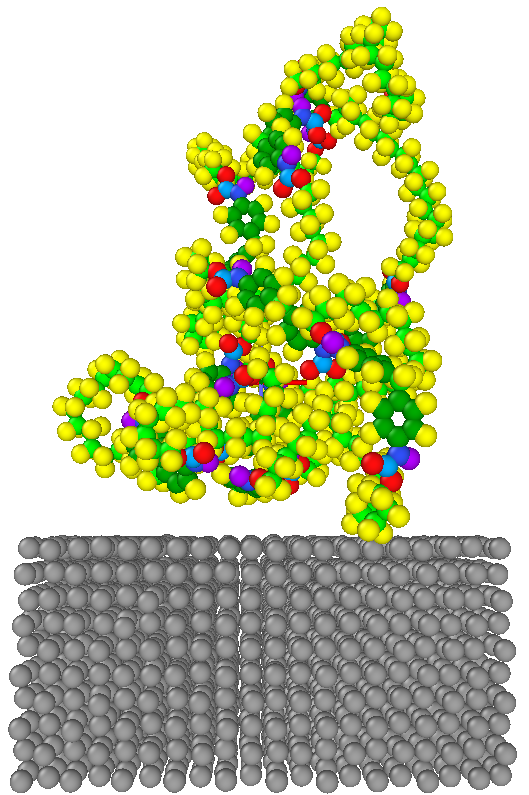
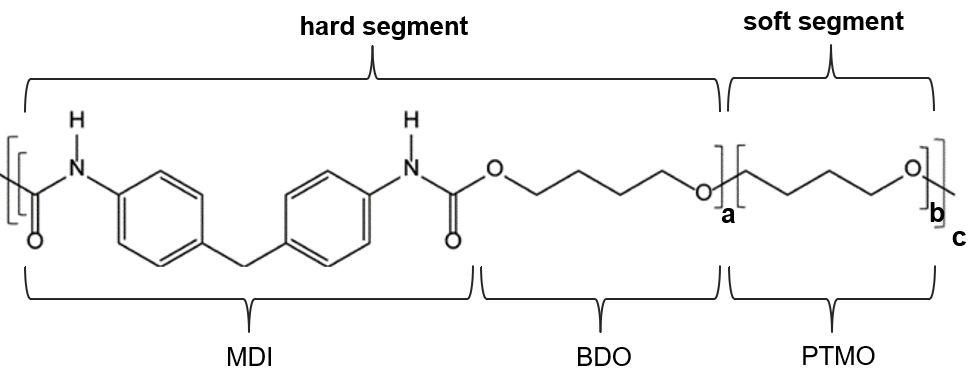
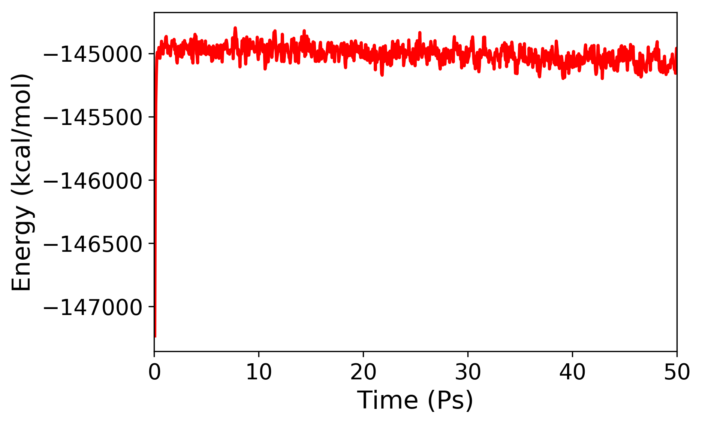

# Molecular Dynamics Simulations of a Polymer-Metal Interface

We are currently investigating [the impact resistance of multilayers using molecular dynamics.](https://www.linkedin.com/pulse/mechanical-behaviour-nanomaterials-under-shock-nuwan-dewapriya/) This project showed us that the modeling of material interfaces could be challenging even for someone with a background in atomic simulations. Therefore, we would like to share some useful information and the LAMMPS input files to model the aluminum-polyurethane system shown below. A movie of the simulation is [available here](https://youtu.be/Nx7B1W6U_m8).

 
 
 
# Modeling of aluminum:
The command create_atoms in LAMMPS was used to model aluminum. [In this tutorial](https://github.com/mrkllntschpp/lammps-tutorials/blob/master/LAMMPS-Tutorials-03.ipynb), Mark Tschopp outlines how to use the create_atoms command to generate a crystal containing a grain boundary. 
I used the [EAM potential by Adams and Ercolessi](https://openkim.org/id/EAM_Dynamo_ErcolessiAdams_1994_Al__MO_123629422045_005) to model aluminum. 

# Modeling of polyurethane:
Modeling polymers can be challenging depending on the complexity of an individual polymer chain. The structure of the polyurethane chain shown in the above video can be depicted as below.

 
 
I created the polymer chain using the [Enhanced Monte Carlo Package](http://montecarlo.sourceforge.net/emc/Welcome.html) by Pieter J. in ’t Veld.  [Moltemplate](https://www.moltemplate.org/) by Andrew Jewett is another useful tool to build polymers. Both Pieter and Andrew were very helpful when I was modeling polymers. I used the polymer consistent force field (PCFF) to model polyurethane.

Mark Tschopp has provided an overview of modeling of [a polymer chain](https://github.com/mrkllntschpp/lammps-tutorials/blob/master/LAMMPS-Tutorials-08.ipynb) and an [amorphous polyethylene sample](https://icme.hpc.msstate.edu/mediawiki/index.php/Deformation_of_Amorphous_Polyethylene) in LAMMPS. Moreover, Appendix A of the reference [1] and the reference [2] provide some useful information about modeling polymers. 

# Aluminum-polyurethane interface:
The two data files (i.e. polyurethane and aluminum) can be combined using MATLAB or even MS Excel. When combining the two models, careful attention needed to be paid to the image flags of the atoms in the polymer to make sure that they do not have crossed the periodic boundary. The two potentails used for the simulation (e.g., PCFF and EAM) must be in similar [LAMMPS units](https://lammps.sandia.gov/doc/units.html).
In this simulation, the non-bonded interactions between aluminum and polyurea were modelled using the van der Waals parameters available in the [interface force field](https://bionanostructures.com/interface-md/).

The Python script [plot_energy.py](plot_energy.py) can be used to plot the variation of energy with time (see below):

 

I used [OVITO](https://www.ovito.org/) to visulalize MD tragectories of this simulation. A great introductory tutorial about OVITO is [available here](https://youtu.be/z4rogk8pdt4). [VMD](https://www.ks.uiuc.edu/Research/vmd/vmd-1.9.3/) is another very useful visualization tool. 

Many simulation questions have been answered in the [LAMMPS mail list](https://lammps.sandia.gov/mail.html). If you would like to learn the basics of atomic simulations, the book [Modeling Materials: Continuum, Atomistic and Multiscale Techniques](http://www.modelingmaterials.org/the-books) could be useful.

More information about modelling aluminum-polyurea multilayers is available in our publication: [Energy absorption mechanisms of nanoscopic multilayer structures under ballistic impact loading.](https://www.sciencedirect.com/science/article/abs/pii/S0927025621002299)

The LAMMPS files required to run MD simulations of impact tests of the aluminum/polyurea structure shown below is [available here.](https://github.com/nuwan-d/md_impact_tests)

 

I hope that this information and the LAMMPS files will be useful for those who are interested in modeling of material interfaces. Good luck!

# References
[1] A.P. Awasthi, D.C. Lagoudas, D.C. Hammerand, Modeling of graphene–polymer interfacial mechanical behavior using molecular dynamics, Model. Simul. Mater. Sci. Eng. 17 (2009) 015002.

[2] D. Hossain, M.A. Tschopp, D.K. Ward, J.L. Bouvard, P. Wang, M.F. Horstemeyer, Molecular dynamics simulations of deformation mechanisms of amorphous polyethylene, Polymer 51 (2010) pp. 6071-6083.
